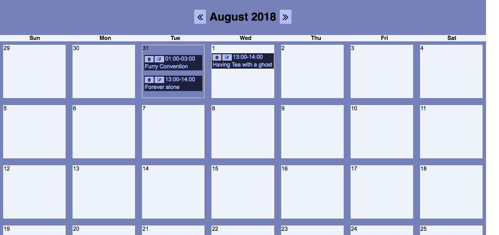
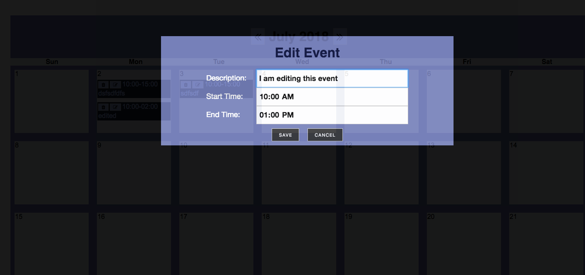

# Events Calendar in React & Node 

Save events to your Monthly Calendar. User is able to make a get, post, update & delete request
to the database. More features and Heroku deployment coming soon! :neckbeard:

## Technologies used:

* React
* Javascript
* Node
* JSX
* PSQL
* Express
* CSS

## Specs:

* The User can click on a day to access input submit form
* The User can use a scroll bar to see multiple events in one day
* User is able to click on left and right arrows to switch months
* User is able to click on trash can & pencil icons to delete & update events

## To check out the game locally

    `npm install in calendarbackend and calendarfrontend
     npm run start in calendarfrontend (navigate to: http://localhost:3000)
     npm run dev in calendarbackend (navigate to: http://localhost:30001)`

